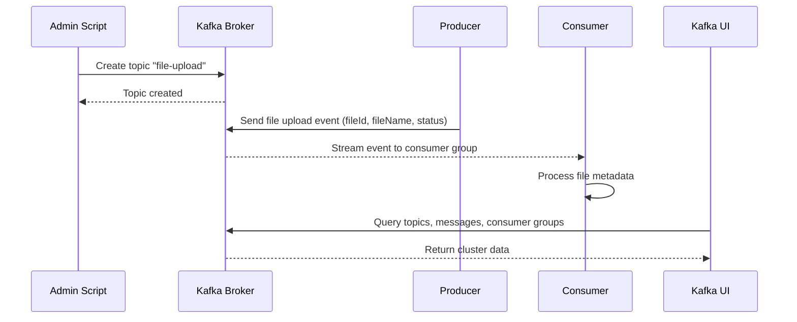

# Node.js Kafka Sample

This project demonstrates a common use case of Apache Kafka in a Node.js environment using TypeScript and the `kafkajs` library.

## Architecture Diagram

The following Mermaid diagram illustrates the data flow between the different components of this sample project:



## How It Works

Kafka is a distributed streaming platform that allows you to publish and subscribe to streams of records. In this project, we demonstrate a **File Upload** workflow:

1.  **Admin ([admin.ts](admin.ts))**:
    - Connects to the Kafka broker.
    - Ensures that the required topic (`file-upload`) exists.
2.  **Producer ([producer.ts](producer.ts))**:
    - Simulates a service that just received a file upload.
    - Sends a JSON payload containing metadata like `fileId`, `fileName`, and `status` to the `file-upload` topic.
3.  **Consumer ([consumer.ts](consumer.ts))**:
    - Simulates a downstream service (e.g., an image processing or virus scanning service).
    - Subscribes to the `file-upload` topic and logs the incoming metadata.
4.  **Kafka UI**:
    - A web-based management interface for monitoring and managing the Kafka cluster.
    - Accessible at [http://localhost:8080](http://localhost:8080).
    - Allows you to browse topics, view messages, monitor consumer groups, and inspect broker configuration.

## Prerequisites

- Node.js installed.
- Docker and Docker Compose installed (to run the Kafka broker and UI).

## Getting Started

1.  **Start Kafka and Kafka UI**:
    Use Docker Compose to start the Kafka broker (KRaft mode, no Zookeeper needed) and the web UI:

    ```bash
    docker-compose up -d
    ```

2.  **Install Dependencies**:

    ```bash
    pnpm install
    ```

3.  **Initialize Topic**:
    Run the admin script to create the `file-upload` topic:

    ```bash
    pnpm run admin
    ```

4.  **Start the Consumer**:
    In one terminal, start the consumer to listen for events:

    ```bash
    pnpm run consumer
    ```

5.  **Send a File Upload Event**:
    In another terminal, run the producer:

    ```bash
    pnpm run producer
    ```

6.  **Open Kafka UI**:
    Navigate to [http://localhost:8080](http://localhost:8080) in your browser to view topics, messages, and consumer groups.

## Stopping the Server

When you're done, you can stop all services with:

```bash
docker-compose down
```

You should see the messages sent by the producer appearing in the consumer's terminal output.

## Technical Stack

- **TypeScript**: Provides type safety and better developer experience.
- **kafkajs**: A modern Kafka client for Node.js.
- **tsx**: Fast TypeScript execution without a separate build step.
- **Apache Kafka (KRaft)**: Lightweight Kafka image running in KRaft mode (no Zookeeper dependency).
- **Kafka UI**: Web-based management interface for Kafka ([provectuslabs/kafka-ui](https://github.com/provectus/kafka-ui)).
