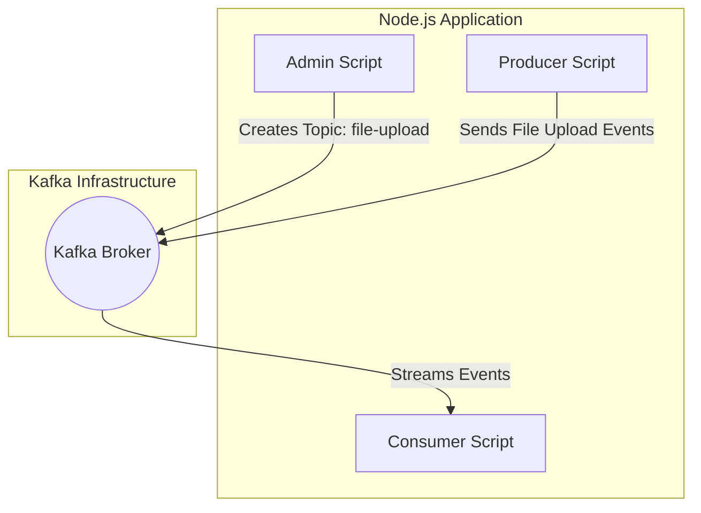

# Node.js Kafka Sample

This project demonstrates a common use case of Apache Kafka in a Node.js environment using TypeScript and the `kafkajs` library.

## Architecture Diagram

The following Mermaid diagram illustrates the data flow between the different components of this sample project:



## How It Works

Kafka is a distributed streaming platform that allows you to publish and subscribe to streams of records. In this project, we demonstrate a **File Upload** workflow:

1.  **Admin ([admin.ts](admin.ts))**: 
    *   Connects to the Kafka broker.
    *   Ensures that the required topic (`file-upload`) exists.
2.  **Producer ([producer.ts](producer.ts))**: 
    *   Simulates a service that just received a file upload.
    *   Sends a JSON payload containing metadata like `fileId`, `fileName`, and `status` to the `file-upload` topic.
3.  **Consumer ([consumer.ts](consumer.ts))**: 
    *   Simulates a downstream service (e.g., an image processing or virus scanning service).
    *   Subscribes to the `file-upload` topic and logs the incoming metadata.

## Prerequisites

*   Node.js installed.
*   Docker and Docker Compose installed (to run the Kafka broker).

## Getting Started

1.  **Start Kafka**:
    Use Docker Compose to start the Kafka broker and Zookeeper:
    ```bash
    docker-compose up -d
    ```

2.  **Install Dependencies**:
    ```bash
    npm install
    ```

3.  **Initialize Topic**:
    Run the admin script to create the `file-upload` topic:
    ```bash
    npm run admin
    ```

4.  **Start the Consumer**:
    In one terminal, start the consumer to listen for events:
    ```bash
    npm run consumer
    ```

5.  **Send a File Upload Event**:
    In another terminal, run the producer:
    ```bash
    npm run producer
    ```

## Stopping the Server

When you're done, you can stop the Kafka server with:
```bash
docker-compose down
```


You should see the messages sent by the producer appearing in the consumer's terminal output.

## Technical Stack

*   **TypeScript**: Provides type safety and better developer experience.
*   **kafkajs**: A modern Kafka client for Node.js.
*   **tsx**: Fast TypeScript execution without a separate build step.
